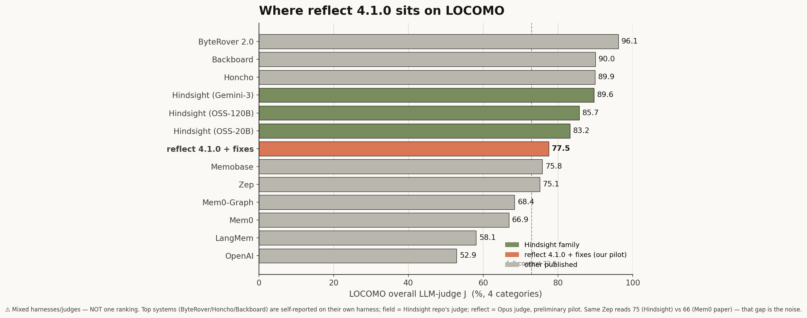

# reflect

> **Long-term memory for AI coding agents — correct once, never again.**

<p align="center">
  
</p>

<p align="center">
  <a href="https://github.com/stevengonsalvez/ainb-reflect-memory/actions/workflows/ci.yml"></a>
  <a href="./LICENSE"></a>
  <a href="./pyproject.toml">=3.11" /></a>
  <a href="./tests/eval/locomo/REPORT.md"></a>
</p>

reflect captures every correction and design decision your AI assistant makes, indexes them into a hybrid **GraphRAG + BM25** knowledge base, and **auto-recalls** the relevant ones at the start of every new session — automatically, before the first token of your prompt is generated.

Works across **Claude Code**, **Codex CLI**, and **GitHub Copilot** — same engine, same KB, three harnesses.

---

## Why

If you've used AI coding assistants for more than a week, you've corrected the same mistake twice. Maybe ten times. The assistant doesn't remember that:

- Your team uses Bun, not Node, for that one repo
- The Postgres migration in your project must run before the seed
- That third-party library has a footgun you discovered last month
- "When I ask you to delete files, also clean the imports"

The context window forgets the moment the session ends. reflect fixes that by **capturing** corrections as structured learnings, **indexing** them into a searchable knowledge base, and **recalling** the relevant ones at the start of every new session — so a fix you make once is a fix you never have to make again.

---

## Install

The engine lives at the repo root — install it with `uv` and the `[graph]` extra (pulls the full GraphRAG + vector stack):

```bash
uv tool install --upgrade 'git+https://github.com/stevengonsalvez/ainb-reflect-memory.git[graph]'
```

Verify with `reflect --version`.

### Quickstart

```bash
reflect init                                    # one-time: create the KB at ~/.claude/global-learnings/
reflect add ./my-solution.md                    # capture a learning (optional --entities sidecar)
reflect search "how did we fix the tokio panic" # hybrid GraphRAG + BM25 recall
```

The Claude Code **plugin** (hooks + skills) that wires this into your agent harness lives under [`plugin/`](./plugin/) — see [plugin/README.md](./plugin/README.md) for the one-step `claude plugin install` flow plus the Codex / Copilot adapters.

---

## How it works

reflect runs a **capture → index → recall** loop:

```
┌──────────────┐   corrections,    ┌──────────────┐   hybrid search   ┌──────────────┐
│   1. CAPTURE │   root causes,    │   2. INDEX   │   top-3 reranked  │   3. RECALL  │
│              │──design decisions▶│              │──by confidence × ▶│              │
│  /reflect +  │                   │ GraphRAG +   │   recency × tags  │ SessionStart │
│ PreCompact   │                   │ BM25 (local) │                   │ hook + /recall│
└──────────────┘                   └──────────────┘                   └──────────────┘
       ▲                                                                      │
       └──────────────── injected back into the agent's context ◀────────────┘
```

1. **Capture** — `/reflect` analyses your conversation, classifies corrections vs. successes, and writes a Markdown learning note plus a YAML entity sidecar (people, files, libraries, decisions). A `PreCompact` hook fires automatically when the agent compacts a conversation, so nothing is lost.
2. **Index** — notes are dual-indexed: nano-graphrag for semantic + entity-graph search, qmd for fast BM25 lexical search. Both run locally on your machine — nothing leaves it.
3. **Recall** — at every `SessionStart`, a hook runs hybrid search using the new session's working dir + recent commits as the query, fuses the results, reranks by confidence × recency × tag overlap, and injects the top three into the agent's context before you type anything.

---

## Benchmark

reflect 4.1.0 evaluated on [LOCOMO](https://github.com/snap-research/locomo) (long-term conversational memory). **Preliminary**: a category-stratified pilot graded by an **Opus** reference LLM-judge. Retrieval runs reflect's **real** engine; the dialogue→note extraction is a documented LOCOMO-domain adapter. The judge is load-bearing — cheaper judges systematically under-credit valid paraphrases — so every figure uses the Opus reference.

| config · Opus judge | single-hop | multi-hop | temporal | open-domain | adversarial | **overall** |
|---|:--:|:--:|:--:|:--:|:--:|:--:|
| **reflect 4.1.0 + retrieval fixes** | 0.80 | 0.80 | 0.80 | 0.70 | 0.90 | **0.80** |

The retrieval fixes are two additive, env-gated, **zero-new-API-key** knobs: a stronger local embedder (`REFLECT_EMBED_MODEL=BAAI/bge-base-en-v1.5`) and **HyDE** query-expansion (`REFLECT_RECALL_HYDE=1`, reusing reflect's own `claude -p`). Both default off — shipped behavior is unchanged.



reflect lands mid-field — on par with Memobase / Zep, above Mem0 — while the newest systems (ByteRover, Honcho, Hindsight) sit higher but are self-reported on their own harnesses. Judges and harnesses differ across the field, so treat this as **directional placement, not a strict ranking**. Full methodology, per-fix ablation, and judge calibration: [`tests/eval/locomo/REPORT.md`](./tests/eval/locomo/REPORT.md).

---

## Cross-harness

One engine, one knowledge base, three harnesses. A correction captured in Claude Code is recalled in Codex; a footgun learned in Copilot surfaces back in Claude.

| Harness | Wiring | Memory source ingested |
|---|---|---|
| **Claude Code** | Native plugin — SessionStart / UserPromptSubmit / Stop / PreCompact hooks | `~/.claude/projects/<hash>/memory/*.md` |
| **Codex CLI** | Python adapter (`plugin/adapters/codex/`) | `~/.codex/memories/*.md` + `~/.codex/AGENTS.md` |
| **GitHub Copilot** | Python adapter (`plugin/adapters/copilot/`) | `~/.copilot/AGENTS.md` |

All sources flow through one ingest pipeline and land in one place: `~/.learnings/documents/`, dual-indexed into graph + vector stores.

---

## Repo layout

```
ainb-reflect-memory/
├── pyproject.toml          # the reflect engine (Python package `reflect-kb`)
├── src/reflect_kb/         # CLI + retrieval engine (GraphRAG + BM25)
├── tests/                  # engine tests + the LOCOMO benchmark harness
│   └── eval/locomo/        # REPORT.md, positioning plot, eval scripts
├── docs/                   # engine docs (usage, architecture)
├── schemas/                # learning-note + entity-sidecar schemas
├── scripts/                # helper scripts
├── assets/                 # mascot + branding
└── plugin/                 # the Claude Code plugin (hooks + skills)
    ├── .claude-plugin/plugin.json   # plugin manifest (v4.1.x)
    ├── skills/             # reflect, reflect:recall, reflect:ingest, …
    ├── hooks/              # SessionStart / PreCompact / Stop / PostToolUse
    └── adapters/           # codex + copilot cross-harness adapters
```

**Two version streams — don't confuse them.** The **engine** is the Python package `reflect-kb`, versioned in [`pyproject.toml`](./pyproject.toml). The **plugin** that wires the engine into the agent harness follows its own semver in [`plugin/.claude-plugin/plugin.json`](./plugin/.claude-plugin/plugin.json) (currently 4.1.x). When asked "what version of reflect is installed?" you usually want both: `reflect --version` for the engine and the plugin manifest for the harness wiring.

**Key split:** the engine is the data layer — it knows nothing about any specific harness. The plugin is the orchestrator — it knows when to capture, drain, recall, and surface.

---

## Documentation

- 🔌 **[plugin/README.md](./plugin/README.md)** — the Claude Code plugin: install flow, hooks, sub-skills, cross-harness adapters, live timeline dashboard
- 📊 **[tests/eval/locomo/REPORT.md](./tests/eval/locomo/REPORT.md)** — full LOCOMO methodology, per-fix ablation, and judge calibration
- 📄 **[LICENSE](./LICENSE)** — MIT

---

## License

MIT. See [LICENSE](./LICENSE).
