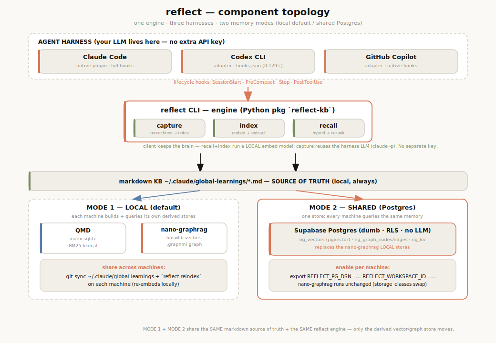

# reflect

> **Long-term memory for AI coding agents — correct once, never again.**

<p align="center">
  
</p>

<p align="center">
  <a href="https://github.com/stevengonsalvez/ainb-reflect-memory/actions/workflows/ci.yml"></a>
  <a href="./LICENSE"></a>
  <a href="./pyproject.toml">=3.11" /></a>
  <a href="./tests/eval/locomo/REPORT.md"></a>
</p>

reflect captures every correction and design decision your AI assistant makes, indexes them into a hybrid **GraphRAG + BM25** knowledge base, and **auto-recalls** the relevant ones at the start of every new session — automatically, before the first token of your prompt is generated.

Works across **Claude Code**, **Codex CLI**, and **GitHub Copilot** — same engine, same KB, three harnesses.

> 📖 **Full documentation → [stevengonsalvez.github.io/agents-in-a-box](https://stevengonsalvez.github.io/agents-in-a-box/)** — architecture, per-harness setup, and the Postgres backend in depth.

---

## Why

If you've used AI coding assistants for more than a week, you've corrected the same mistake twice. Maybe ten times. The assistant doesn't remember that:

- Your team uses Bun, not Node, for that one repo
- The Postgres migration in your project must run before the seed
- That third-party library has a footgun you discovered last month
- "When I ask you to delete files, also clean the imports"

The context window forgets the moment the session ends. reflect fixes that by **capturing** corrections as structured learnings, **indexing** them into a searchable knowledge base, and **recalling** the relevant ones at the start of every new session — so a fix you make once is a fix you never have to make again.

---

## Install

The engine lives at the repo root — install it with `uv` and the `[graph]` extra (pulls the full GraphRAG + vector stack):

```bash
uv tool install --upgrade 'git+https://github.com/stevengonsalvez/ainb-reflect-memory.git[graph]'
```

Verify with `reflect --version`.

### Quickstart

```bash
reflect init                                    # one-time: create the KB at ~/.claude/global-learnings/
reflect add ./my-solution.md                    # capture a learning (optional --entities sidecar)
reflect search "how did we fix the tokio panic" # hybrid GraphRAG + BM25 recall
```

### Plugin (Claude Code)

The **plugin** (hooks + skills) that wires reflect into your agent harness lives under [`plugin/`](./plugin/). Install it from this repo's marketplace:

```bash
claude plugin marketplace add stevengonsalvez/ainb-reflect-memory
claude plugin install reflect@ainb-reflect-memory
```

See [plugin/README.md](./plugin/README.md) for the lifecycle hooks, sub-skills, and the Codex / Copilot adapters. (`ainb reflect bootstrap` installs the engine + prints system-tool steps in one shot.)

---

## How it works

reflect runs a **capture → index → recall** loop:

<p align="center">
  
</p>

1. **Capture** — `/reflect` analyses your conversation, classifies corrections vs. successes, and writes a Markdown learning note plus a YAML entity sidecar (people, files, libraries, decisions). A `PreCompact` hook fires automatically when the agent compacts a conversation, so nothing is lost.
2. **Index** — notes are dual-indexed: nano-graphrag for semantic + entity-graph search, qmd for fast BM25 lexical search. Both run locally on your machine — nothing leaves it.
3. **Recall** — at every `SessionStart`, a hook runs hybrid search using the new session's working dir + recent commits as the query, fuses the results, reranks by confidence × recency × tag overlap, and injects the top three into the agent's context before you type anything.

---

## Two ways to run: local or shared

The markdown KB (`~/.claude/global-learnings/*.md`) is **always** the local
source of truth, and **all LLM/embedding/clustering always stays client-side**.
What changes between the two modes is only the *derived* vector + graph store.

| | **Mode 1 — Local** (default) | **Mode 2 — Shared** (Postgres) |
|---|---|---|
| Derived store | per-machine: QMD `index.sqlite` (BM25) + nano-graphrag (hnswlib + `.graphml`) | one **Supabase Postgres** (pgvector) for everyone |
| Setup | nothing — works out of the box | set 2 env vars + apply 2 migrations |
| Share across machines | git-sync the markdown KB, then `reflect reindex` on each machine (re-embeds locally) | automatic — every machine queries the same store |
| Best for | solo / single machine / offline | laptop + desktop + CI sharing one memory |

**Mode 1 — local (default).** Nothing to configure. To use the same memory on
another machine, sync the source notes and rebuild the index there:

```bash
# on each machine, after syncing ~/.claude/global-learnings (e.g. via git):
reflect reindex            # re-embeds + rebuilds the local graph/vector store
```

**Mode 2 — shared Postgres.** nano-graphrag runs **unchanged** — it's handed
Postgres-backed storage classes (the same way it ships `Neo4jStorage`), so the
vector + graph + community store lives in one shared DB. Opt in per machine:

```bash
pip install '.[graph,postgres]'                                   # postgres extra = psycopg
psql "$REFLECT_PG_DSN" -f supabase/migrations/0001_reflect_memory_phase1.sql
psql "$REFLECT_PG_DSN" -f supabase/migrations/0002_nanographrag_pgvector.sql
export REFLECT_PG_DSN=postgresql://…        # the trigger (NOT the generic DATABASE_URL)
export REFLECT_WORKSPACE_ID=<uuid>           # hard tenant boundary
```

Unset → Mode 1, unchanged. The DB is **dumb**: no LLM, no embeddings — it
stores, scopes by tenant, and runs ANN/graph reads. Tenant isolation is RLS
(fail-closed) on the direct path + explicit `workspace_id` scoping on the
trusted-worker path; writes need a `service_role` DSN. Full setup + threat
model: [`docs/setup.md`](./docs/setup.md) · [`docs/regression-suite.md`](./docs/regression-suite.md).

---

## Benchmark

reflect 4.1.0 evaluated on [LOCOMO](https://github.com/snap-research/locomo) (long-term conversational memory). **Preliminary**: a category-stratified pilot graded by an **Opus** reference LLM-judge. Retrieval runs reflect's **real** engine; the dialogue→note extraction is a documented LOCOMO-domain adapter. The judge is load-bearing — cheaper judges systematically under-credit valid paraphrases — so every figure uses the Opus reference.

| config · Opus judge | single-hop | multi-hop | temporal | open-domain | adversarial | **overall** |
|---|:--:|:--:|:--:|:--:|:--:|:--:|
| **reflect 4.1.0 + retrieval fixes** | 0.80 | 0.80 | 0.80 | 0.70 | 0.90 | **0.80** |

The retrieval fixes are two additive, env-gated, **zero-new-API-key** knobs: a stronger local embedder (`REFLECT_EMBED_MODEL=BAAI/bge-base-en-v1.5`) and **HyDE** query-expansion (`REFLECT_RECALL_HYDE=1`, reusing reflect's own `claude -p`). Both default off — shipped behavior is unchanged.


reflect lands mid-field — on par with Memobase / Zep, above Mem0 — while the newest systems (ByteRover, Honcho, Hindsight) sit higher but are self-reported on their own harnesses. Judges and harnesses differ across the field, so treat this as **directional placement, not a strict ranking**. Full methodology, per-fix ablation, and judge calibration: [`tests/eval/locomo/REPORT.md`](./tests/eval/locomo/REPORT.md).

---

## Why build, not adopt

reflect didn't start as a from-scratch idea. We evaluated the agent-memory field at depth — four
systems read line-by-line (Hindsight, ByteRover, agentmemory, claude-mem), plus Mem0, Honcho and
OpenViking — and deliberately chose to **port the best retrieval ideas into a local-first engine**
rather than adopt any one wholesale ([epic + per-feature source permalinks](https://github.com/stevengonsalvez/agents-in-a-box/discussions/227)).
Here's the reasoning.

### The landscape

| Tool | What it stores | Extra LLM/embed key? | Runs as | First-class coding signals | License |
|---|---|---|---|---|---|
| **reflect** | **selective** learnings; markdown = source of truth | **No** — reuses the agent's own model + local embeddings | **local files** (sqlite + graphml); optional shared Postgres | **Yes** — corrections, tests, tool-loops, git, todos, permissions, contradictions, skill-refresh | MIT |
| [Hindsight](https://github.com/vectorize-io/hindsight) | LLM-extracted facts + mental models | Yes for writes¹ | local daemon → Docker (FastAPI+Postgres) → cloud | No — extracted from prose; skill-capture is a [logged bug](https://github.com/vectorize-io/hindsight/discussions/1643) | MIT |
| [Mem0](https://github.com/mem0ai/mem0) | LLM-extracted facts | **Yes** — OpenAI by default at ingest | library → Docker (Postgres+Neo4j); graph = Pro $249/mo | No — hooks, but no correction/git/test capture | Apache-2.0 + SaaS |
| [ByteRover](https://github.com/campfirein/byterover-cli) | curated markdown tree | curation makes its own LLM calls | local files + node daemon; optional cloud sync | No — curation is agent-*directed*, not passive | Elastic 2.0 (not OSS) |
| [claude-mem](https://github.com/thedotmack/claude-mem) | every tool call → compressed observations | **No** — reuses Claude auth + local embeddings | always-on Bun daemon + optional ChromaDB | No — probabilistic Haiku extraction | Apache-2.0 |
| [agentmemory](https://github.com/rohitg00/agentmemory) | **fire-hose** — every tool call, verbatim | optional (value degrades without it) | always-on Rust daemon (4 ports) | No — raw events; little structure without LLM | Apache-2.0 |
| [Honcho](https://github.com/plastic-labs/honcho) | user/peer models (theory-of-mind) | Yes (self-host); cloud is per-token | Postgres + Redis + deriver worker; or cloud | No — built for end-user personalization, not coding | AGPL-3.0 |
| [OpenViking](https://github.com/volcengine/OpenViking) | LLM-extracted memories/skills (tiered) | **Yes** — OpenAI/Volcengine by default | Rust+Go+C++ server, always-on | No — git/test/skill not first-class | AGPL-3.0 |

¹ Hindsight's `retain` needs an LLM. Its "reuse your Claude subscription" loopback (`claude-code`
provider) is documented as **personal-use-only per Anthropic's terms** — so it can't be the shipped
default for a tool other people install.

### The four things that decided it

1. **Storing whole sessions is noisy and grows without bound.** claude-mem and agentmemory capture
   every tool call; even the fact-extractors accumulate (Mem0 has a [dedup gap](https://github.com/mem0ai/mem0/issues/4896),
   agentmemory hits an O(N²) forget ceiling). reflect captures **selectively** — only signal-bearing
   moments become learnings — with TTL, dedup and contradiction-handling built in. The markdown notes
   stay the source of truth; the derived index is disposable.

2. **A separate LLM + infra is operational weight, often cloud-bound.** Hindsight, Mem0, OpenViking and
   Honcho want a running server (Postgres / Redis / a Rust or Bun daemon / a vector DB) and a model
   provider. reflect runs from **local files** (sqlite + graphml) with no server; Postgres is opt-in,
   only when you *want* a shared cross-machine store.

3. **Your coding agent already has a model — memory shouldn't need a second subscription.** Mem0,
   OpenViking, Honcho (self-host) and Hindsight (for writes) make you configure and pay for a *second*
   provider key just for memory. reflect **reuses the agent's own model** (`claude -p`) for capture and a
   **local embedding model** for recall — no extra key, no second subscription, and no ToS loophole.
   *(Honest caveat: claude-mem also reuses Claude's auth — it ties reflect on this one axis.)*

4. **None of them capture coding signals as first-class events.** Corrections, test pass/fail,
   tool-loops, git commit/revert, todo completions, permission replies, cross-turn contradictions — every
   other tool hopes an LLM extracts these from the transcript prose (Hindsight literally files skill
   capture as a *bug*). reflect routes them as **typed signals** at hook time (`SG1`–`SG8`) and
   auto-refreshes the skills they affect (`R13`/`R14`). This is the wedge nothing else fills.

Beyond those: reflect is **cross-harness** (Codex writes, a later Claude session reads), keeps a
**reviewable markdown source of truth** with clean git diffs (volatile signals live in a DB sidecar),
and ships under a **permissive MIT** license — where ByteRover is Elastic-2.0 and Honcho/OpenViking are
AGPL.

### The strongest adopt case — Hindsight — and why we still ported

Hindsight is the best "just adopt it" candidate: MIT, production-grade, multi-strategy retrieval
(RRF + cross-encoder + graph + temporal), a 94.6% LongMemEval result, and ~48 integrations. Adopting it
would have bought a more mature retrieval stack and a bigger ecosystem than building.

We ported instead because the things that make reflect *fit a coding workflow* are exactly the things
Hindsight's architecture can't give without its baggage: zero-extra-key capture (Hindsight needs an LLM
for `retain`, or the personal-use-only loopback), local-first with no mandatory server, and **typed
signal capture** (Hindsight extracts from prose). Crucially, Hindsight's retrieval *ideas* aren't
locked away — the [57-port effort](https://github.com/stevengonsalvez/agents-in-a-box/discussions/227)
brought the graph-expansion arm, RRF fusion, cross-encoder rerank and temporal arm into reflect's
recall layer ([recall reference](https://stevengonsalvez.github.io/agents-in-a-box/knowledge/reflect-memory/recall/)).
The result: **Hindsight's retrieval brains, a local-first body, plus the signal capture Hindsight
doesn't do** — with the honest caveats spelled out in the critique below.

### Critique: should we have just adopted Hindsight?

We ran an adversarial critique against our own decision. Verdict: **proceed, with eyes open.**

- **Where adopting would have been smarter.** Retrieval is now *ours* to maintain — a ~3k-line recall
  engine (cross-encoder, MMR, RRF, temporal, calibration) that Hindsight amortizes across a team and
  62 releases. reflect lands mid-field on benchmarks; Hindsight sits higher. The re-implemented
  retrieval layer is the least differentiated, highest-maintenance part of the build.
- **Where reflect's wedge genuinely holds.** No-extra-key capture (Hindsight's reuse-your-sub loopback
  is ToS personal-use-only — it can't ship that) and **first-class typed signals** (Hindsight extracts
  from prose; its skill capture is a *logged bug*). These are durable and architectural, not NIH.
- **The discipline it implies.** Own the moat (capture + signals + local-first + cross-harness), keep
  the commodity (retrieval) behind a seam so a stronger backend could be swapped in later. Build what's
  unique; stay swappable on what isn't.

Full treatment — all eight systems, the four deciding axes, and the build-vs-adopt reasoning — in the
[explainer](https://explainers.stevengonsalvez.com/agent-memory-landscape/).

---

## Cross-harness — Claude Code · Codex · Copilot

One engine, one knowledge base, three harnesses. A correction captured in Claude
Code is recalled in Codex; a footgun learned in Copilot surfaces back in Claude.
**No extra LLM/embedding configuration on any of them** — recall + indexing run a
local embedding model (no API key), and capture reuses your harness's own LLM
(`claude -p`). You install one thing per harness; the harness does the rest.

### Install per harness

```bash
# Claude Code — native plugin runtime (auto-wires hooks)
claude plugin marketplace add stevengonsalvez/ainb-reflect-memory
claude plugin install reflect@ainb-reflect-memory

# Codex CLI — no plugin runtime, so an adapter copies skills + merges hooks.json
python plugin/adapters/codex/codex_adapter.py install

# GitHub Copilot — adapter writes a native ~/.copilot/hooks/reflect.json
python plugin/adapters/copilot/copilot_adapter.py install
```

### What each harness supports

| Capability | Claude Code | Codex CLI (0.129+) | GitHub Copilot |
|---|:--:|:--:|:--:|
| Plugin runtime | ✅ native | ❌ adapter copies skills | ❌ adapter copies skills |
| Lifecycle hooks (SessionStart / PreCompact / Stop / PostToolUse) | ✅ | ✅ via `~/.codex/hooks.json` | ✅ via `~/.copilot/hooks/reflect.json` |
| **Auto-recall** at session start | ✅ | ✅ | ✅ (`additionalContext`) |
| **Per-prompt** recall surfacing | ✅ `UserPromptSubmit` | ✅ | ⚠️ **manual `/recall`** — Copilot ignores `userPromptSubmitted` output |
| Auto-capture on compact | ✅ | ✅ | ✅ |

### Caveats to know

- **Codex / Copilot capture needs the `claude` CLI.** The reflection drain
  (`reflect-drain-bg.sh`) shells out to `claude -p /reflect <transcript>` to turn
  a transcript into a learning. It's not a *new* key — it reuses your Claude
  auth — but `claude` must be installed. Without it, capture won't drain → run
  `/reflect` manually in-session.
- **Copilot per-prompt recall is manual.** SessionStart auto-recall works, but
  Copilot drops `userPromptSubmitted` hook output, so mid-session recall is `/recall`.
- **Older Codex (< 0.129)** had no hooks — if you're on an old build, install
  with `--no-hooks` and drive `/reflect` + `/recall` manually each session.

All harnesses' memory flows through one ingest pipeline into one store
(`~/.claude/global-learnings/documents/`; `~/.learnings/` is the legacy alias),
dual-indexed into the graph + vector stores (local or shared Postgres).

---

## Components

The same topology as the diagram above, component by component:

| Layer | Component | What it is | Where |
|---|---|---|---|
| Harness | **lifecycle hooks** | fire capture/recall on SessionStart, PreCompact, Stop, PostToolUse | `plugin/` (+ `plugin/adapters/` for Codex/Copilot) |
| Engine | **reflect CLI** (`reflect-kb`) | capture → index → recall orchestrator | `src/reflect_kb/` |
| Source of truth | **markdown KB** | the learning notes — local, always | `~/.claude/global-learnings/*.md` |
| Local store | **QMD** | BM25 lexical index | `~/.cache/qmd/index.sqlite` |
| Local store | **nano-graphrag** | semantic vectors + entity graph | hnswlib + `.graphml` (per machine) |
| Shared store | **Postgres** (opt-in) | pgvector + graph + KV, RLS, tenant-scoped | `src/reflect_kb/postgres/` + `supabase/migrations/` |

**Two version streams — don't confuse them.** The **engine** is the Python
package `reflect-kb` ([`pyproject.toml`](./pyproject.toml)); the **plugin** that
wires it into a harness has its own semver
([`plugin/.claude-plugin/plugin.json`](./plugin/.claude-plugin/plugin.json),
4.1.x). `reflect --version` reports the engine; the manifest reports the wiring.
The engine is the data layer (harness-agnostic); the plugin is the orchestrator.

---

## Documentation

- 🐘 **[docs/setup.md](./docs/setup.md)** — shared Postgres backend: Supabase setup, secret names, migrations, enabling it, threat model
- 🔌 **[plugin/README.md](./plugin/README.md)** — the Claude Code plugin: install flow, hooks, sub-skills, cross-harness adapters, live timeline dashboard
- 📊 **[tests/eval/locomo/REPORT.md](./tests/eval/locomo/REPORT.md)** — full LOCOMO methodology, per-fix ablation, and judge calibration
- 📄 **[LICENSE](./LICENSE)** — MIT

---

## License

MIT. See [LICENSE](./LICENSE).
