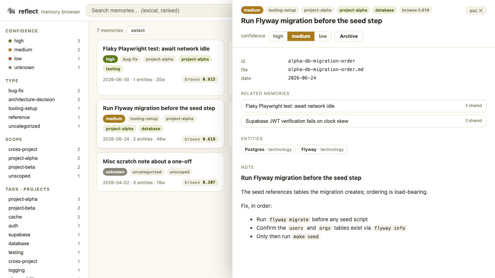
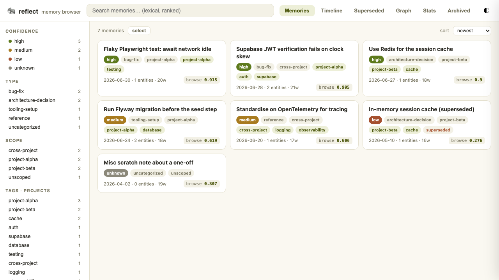
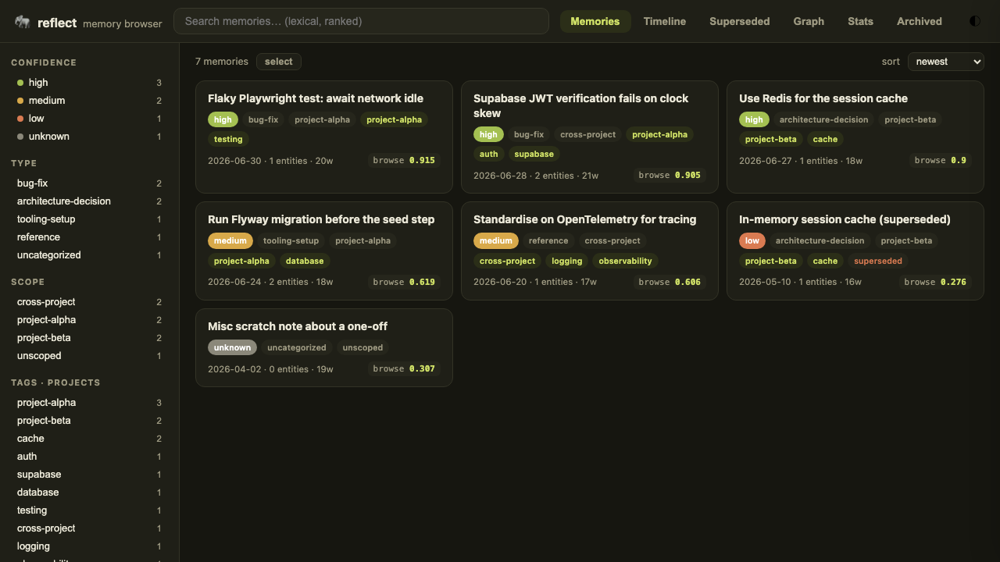
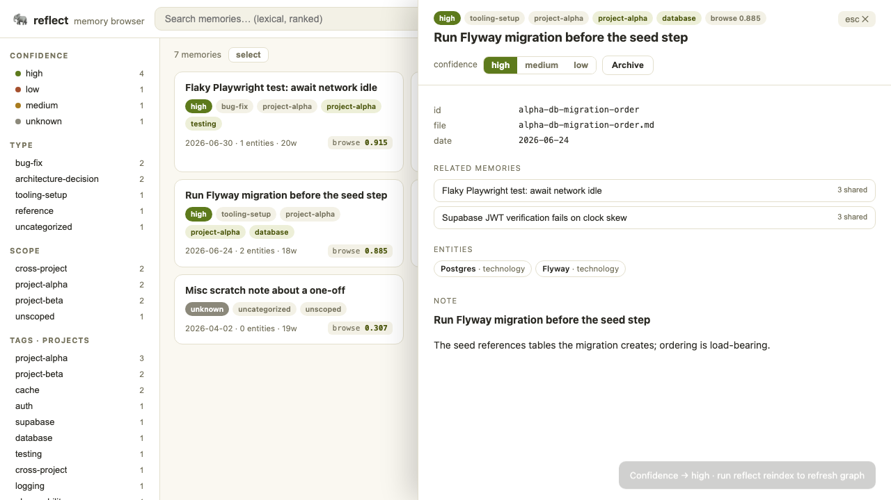
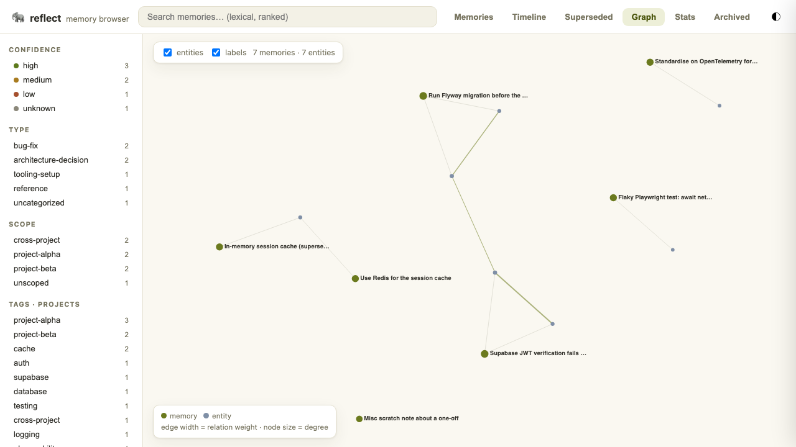
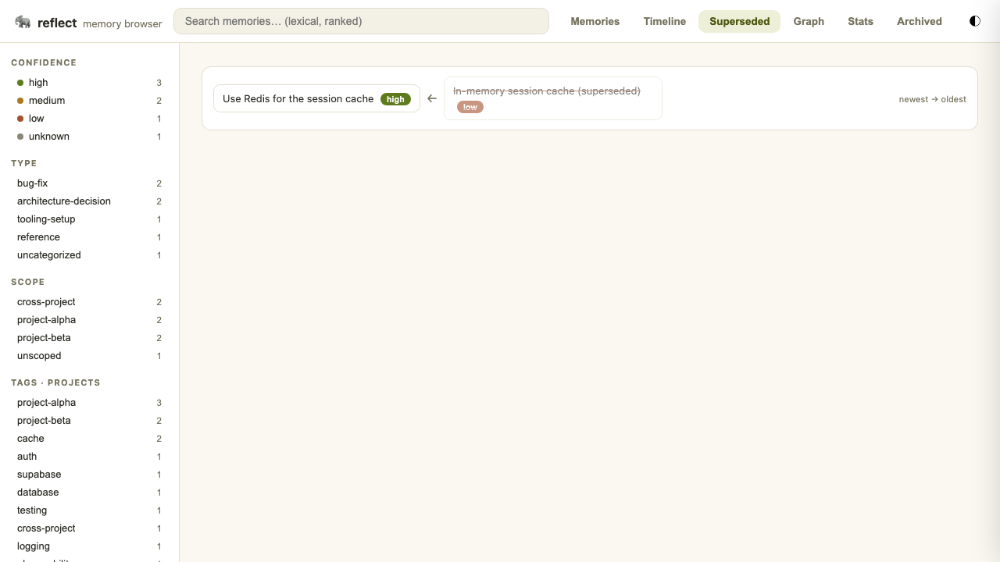
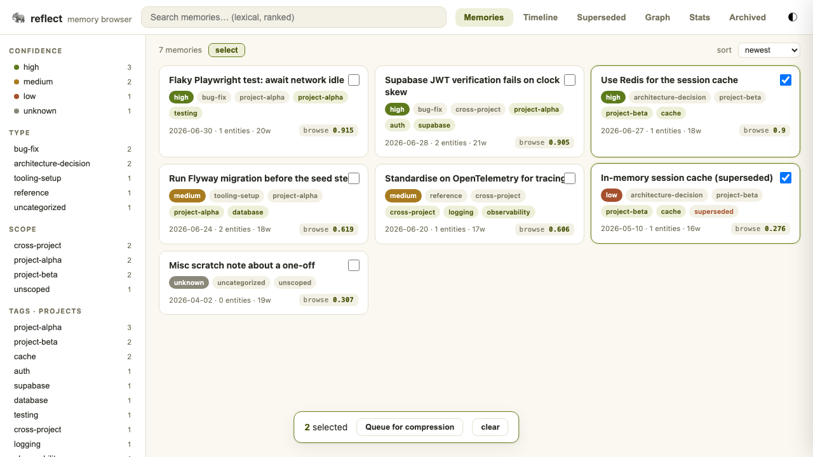

# reflect serve — memory browser

A local web utility for browsing, searching, and curating the reflect knowledge
base. Launch it with the `reflect serve` subcommand; it binds loopback only.

```bash
reflect serve                       # http://127.0.0.1:8377, KB at $GLOBAL_LEARNINGS_PATH or ~/.learnings
reflect serve --port 8942           # pick a port
reflect serve --repo /path/to/kb    # browse a specific KB
```

To reach it from another device on your tailnet, front it with a proxy — the
server itself never leaves loopback:

```bash
tailscale serve --bg --https 8942 http://127.0.0.1:8942
```

## What it does

- **Browse** — a faceted memory list (confidence · type · scope · tags/projects),
  sortable by newest, computed recall score, or title.
- **Search** — lexical BM25 ranking; each result carries a match score and a
  browse-ordering score (confidence × recency × tag overlap). This is a browse
  heuristic, **not** the recall reranker's score — the real reranker
  deliberately dropped exp-decay recency. Full semantic search stays on the
  `reflect search` CLI.
- **Graph** — a two-layer force graph of memory and entity nodes; edge widths
  encode graphml relation weights. Toggle the entity layer, drag/pan/zoom, click
  a memory to open it.
- **Timeline** — memories grouped chronologically.
- **Superseded** — `superseded_by` chains rendered newest tip to oldest ancestor.
- **Curate** — soft-archive/restore (reversible, no hard delete), edit a note's
  confidence, and multi-select memories to queue a group for compression by the
  `/reflect` consolidate skill (written to a versioned `compress-queue.yaml` — the
  web app never calls an LLM).
- **Stats** — confidence/type/scope/tag distributions and engine-op usage counts.

Light and dark themes throughout.

Note bodies render through a small built-in markdown subset (h1-h3, fenced code,
blockquotes, and flat bullet lists) — no external markdown library:



### Weightages surfaced

| Weightage | Where |
|---|---|
| Editable confidence | segmented control in the detail drawer |
| Computed browse score | on every card and in the drawer |
| Graph edge weights | edge width in the Graph view |
| Recall usage stats | engine-op counts in the Stats view |

## Curation is metadata-only and file-first

Mutations edit the markdown note (the source of truth) and the browser view
reloads immediately. The nano-graphrag cache used by `reflect search` is **not**
rebuilt synchronously — the engine only supports a full-batch reindex — so after
archiving or editing confidence, run `reflect reindex` to refresh semantic search
and the entity graph. The UI hints at this. Note bodies stay agent-authored;
only metadata is editable here. Postgres backends are read-only in this release.

Curation is guarded: the server rejects any request whose `Host` isn't loopback
(defeats DNS-rebinding) and requires an `X-Reflect` header on mutations, so only
this same-origin SPA can drive them. There is no auth — do not bind a public
interface.

Soft-archive moves the note into an `archived/` sibling directory. This is the
browser's own reversible delete and is **separate** from the forget sweep's
`.forgotten/` directory, which the sweep manages with its own database
accounting. Archiving here does not run the sweep or touch its records.

## Memory list (light / dark)




## Detail drawer with confidence editing and archive



## Two-layer knowledge graph



## Superseded chains and compression queue




## Tests

End-to-end coverage lives in [`tests/e2e/`](../tests/e2e) (Playwright). The suite
launches `reflect serve` against a fresh copy of `tests/e2e/fixture-kb` — never
your real `~/.learnings` — and drives every flow, saving a screenshot per flow.

```bash
cd tests/e2e && npm install && npx playwright install chromium
npx playwright test
```
