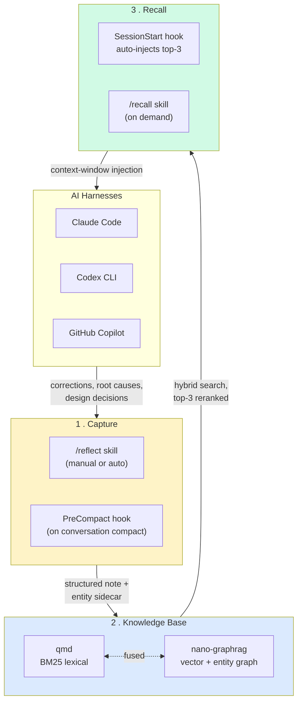

# reflect

> **Correct once, never again.** Capture every correction and design decision your AI assistant makes, index them into a hybrid GraphRAG + BM25 knowledge base, and auto-inject the most relevant prior learnings into every new session.

Works across **Claude Code**, **Codex CLI**, and **GitHub Copilot** — same plugin, same KB, three harnesses.

---

## 📊 LOCOMO benchmark — long-term memory

reflect 4.1.0 evaluated on [LOCOMO](https://github.com/snap-research/locomo) (long-term conversational memory). **Preliminary test:** a category-stratified pilot on conversation `conv-26`; answers generated by **Sonnet**, graded by an **Opus** reference LLM-judge. Retrieval runs reflect-kb's **real** engine; the dialogue→note extraction is a documented LOCOMO-domain adapter. (The judge is load-bearing: on an identical answer set, the score grades ~0.07 lower under a Sonnet judge and ~0.18 lower under Haiku — cheaper judges systematically under-credit valid paraphrases — so every figure below uses the Opus reference.)

| config · Opus judge | single-hop | multi-hop | temporal | open-domain | adversarial | **overall** |
|---|:--:|:--:|:--:|:--:|:--:|:--:|
| reflect 4.1.0 (tuned recall + extraction) | 0.70 | 0.75 | 0.80 | 0.50 | 0.90 | **0.73** |
| **reflect 4.1.0 + retrieval fixes** | 0.80 | 0.80 | 0.80 | 0.70 | 0.90 | **0.80** |

The **+fixes** config adds two additive, env-gated, **zero-new-API-key** knobs: a stronger embedder (`REFLECT_EMBED_MODEL=BAAI/bge-base-en-v1.5`, local) and **HyDE** query-expansion (`REFLECT_RECALL_HYDE=1`, reusing reflect's own `claude -p`). Both default off, so the shipped behavior is unchanged.

### vs other memory systems


reflect's tuned 4-category mean (**77.5**) lands mid-field — on par with **Memobase / Zep**, above **Mem0** — while the newest systems (**ByteRover ~96, Honcho ~90, Hindsight ~90**) sit higher but are self-reported on their own harnesses. Judges/harnesses differ across the field (the same Zep reads 75 on one harness, 66 on another — that gap *is* the cross-harness noise), so this is **directional placement, not a strict ranking**. Full methodology, per-fix ablation, and the judge calibration: [`reflect-kb/tests/eval/locomo/REPORT.md`](../../reflect-kb/tests/eval/locomo/REPORT.md).

---

## Why

If you've used AI coding assistants for more than a week, you've corrected the same mistake twice. Maybe ten times. The assistant doesn't remember that:

- Your team uses Bun, not Node, for that one repo
- The Postgres migration in your project must run before the seed
- That third-party library has a footgun you discovered last month
- "When I ask you to delete files, also clean the imports"

`reflect` fixes that by **capturing** corrections as structured learnings, **indexing** them into a searchable knowledge base, and **recalling** the relevant ones at the start of every new session — automatically, before the first token of your prompt is generated.

---

## How it works



**Flow:**

1. **Capture** — `/reflect` analyses your conversation, classifies corrections vs. successes, and writes a Markdown learning note + a YAML entity sidecar (people, files, libraries, decisions). A `PreCompact` hook auto-fires when the agent compacts a conversation, so nothing gets lost.
2. **Knowledge Base** — notes get dual-indexed: nano-graphrag for semantic + entity-graph search, qmd for fast BM25 lexical search. Both run locally on your machine.
3. **Recall** — at every `SessionStart`, a hook runs hybrid search against the KB using the new session's working dir + recent commits as a query, fuses the results, reranks by confidence × recency × tag overlap, and injects the top three into the agent's context before you type anything.

---

## Mental model — who writes what, when?

The single most common source of confusion is conflating the three different writers that feed the knowledge base. They run on different triggers, write to different paths, and only `/reflect:ingest` is what stitches everything together. Anchor on this picture before reading further:

```
   ┌─────────────────────────────────────────────────────────────────┐
   │  WRITER A — Built-in auto-memory tool                           │
   │            (runs SILENTLY whenever the agent decides to remember)│
   │                                                                 │
   │  Trigger: agent's internal heuristic during the conversation    │
   │  Writes:  ~/.claude/projects/<hash>/memory/feedback_*.md        │
   │           ~/.claude/projects/<hash>/memory/project_*.md         │
   │           ~/.claude/projects/<hash>/memory/user_*.md            │
   │           ~/.claude/projects/<hash>/memory/reference_*.md       │
   │           ~/.claude/projects/<hash>/memory/MEMORY.md  (index)   │
   │                                                                 │
   │  Indexed? NO. Just raw files on disk. Not in any KB yet.        │
   │  Equivalent on other tools:                                     │
   │    Codex:   ~/.codex/memories/*.md                              │
   │    Copilot: ~/.copilot/AGENTS.md                                │
   │    Gemini:  ~/.gemini/GEMINI.md                                 │
   └─────────────────────────────────────────────────────────────────┘
                              │
                              │ time passes — file backlog accumulates
                              │
   ┌──────────────────────────┴───────┬─────────────────────────────┐
   │                                  │                             │
   ▼                                  ▼                             ▼
┌──────────────────────────┐  ┌─────────────────────────┐  ┌─────────────────────┐
│ WRITER B — /reflect      │  │ WRITER B' — auto-drain  │  │ HARVESTER —         │
│ (you invoke manually)    │  │ (PreCompact → drain →   │  │ /reflect:ingest     │
│                          │  │  claude -p /reflect)    │  │ (you invoke         │
│ Source: current convo    │  │                         │  │  periodically)      │
│ transcript               │  │ Same /reflect skill,    │  │                     │
│                          │  │ but run inside a child  │  │ Source: ALL         │
│ Writes:                  │  │ session by the drain    │  │ Writer-A files      │
│ • docs/solutions/<cat>/  │  │ script, on the queued   │  │ across all tools    │
│   <name>.md              │  │ transcript.             │  │                     │
│ • .entities.yaml sidecar │  │                         │  │ Writes:             │
│ • ~/.reflect/episodes/   │  │ Writes the SAME outputs │  │ • ~/.learnings/     │
│   ep-<id>.md             │  │ as Writer B.            │  │   documents/<id>.md │
│                          │  │                         │  │ • .entities.yaml    │
│ Indexes:                 │  │                         │  │ • archived copy in  │
│ reflect add --entities → │  │                         │  │   memories/<proj>/  │
│ ~/.learnings/documents/  │  │                         │  │                     │
│ + graph + vectors        │  │                         │  │ Indexes: same       │
└──────────────────────────┘  └─────────────────────────┘  └─────────────────────┘
                                                                     │
   ┌─────────────────────────────────────────────────────────────────┘
   │
   ▼
┌─────────────────────────────────────────────────────────────────────┐
│  ~/.learnings/  (the UNIFIED KB — every writer above feeds here)    │
│  + ~/.learnings/nano_graphrag_cache/   ← graph                      │
│  + ~/.cache/qmd/index.sqlite           ← vectors                    │
└────────────────────────────────┬────────────────────────────────────┘
                                 │
                                 ▼
                       /recall "<anything>"
```

### What ingest processes — per tool

| Tool | Where it stores memory | What ingest picks up |
|---|---|---|
| **Claude** | `~/.claude/projects/<project-hash>/memory/` | Every `*.md` under that dir — the `MEMORY.md` index AND the atomic per-fact files |
| **Codex** | `~/.codex/memories/` + `~/.codex/AGENTS.md` | Every `.md` in `memories/`; the global `AGENTS.md` |
| **Copilot** | `~/.copilot/AGENTS.md` (single file) | The global `AGENTS.md` |
| **Gemini** | `~/.gemini/GEMINI.md` + `<repo>/GEMINI.md` | Global file + per-project files |
| **(any)** | `<repo>/AGENTS.md` | Per-project `AGENTS.md` files (codex/copilot share this format) |
| **(any)** | `<repo>/.agents/MEMORY.md` | Project-consolidated memory (from `/reflect:consolidate`) |
| **Episodes** | `~/.reflect/episodes/ep-*.md` | Session episode notes (drain output) |
| **Solutions** | `<repo>/docs/solutions/**/*.md` | Knowledge notes that don't have entity sidecars yet |
| **Skills** | `~/.claude/skills/*/references/*.md` | Learnings embedded in skill packages |

All of these flow through ONE pipeline and land in ONE place: `~/.learnings/documents/`.

### The simple mental model

| Action | What it does |
|---|---|
| You type something the agent finds important | Writer A creates a `feedback_*.md` in your project's memory dir. Silent. Always. |
| You explicitly run `/reflect` | Writer B reads the *current conversation*, writes a knowledge note in `docs/solutions/<cat>/` + indexes it. One transcript at a time. |
| PreCompact / Stop fires (auto) | Transcript is **queued**, then a background drain runs `/reflect` (Writer B') on it. Same outputs. Background. |
| You explicitly run `/reflect:ingest` | Harvester reads everything Writer A ever made + similar across other tools, batch-indexes them all. Periodic. |
| You run `/recall` | Searches the unified KB built by all of the above. |

> **v4.0.0 — the auto-drain is cheap by default.** Before spending a single
> token, the drain gates the queued transcript ($0 regex) and skips
> reflect-on-reflect, clean, and no-signal sessions; for anything worth
> reflecting it slices the transcript down to just the signal-bearing windows
> (~10x smaller) and runs `/reflect` on **Sonnet** under hard caps (8 turns,
> 180s, 2M-token budget poison). Inspect spend with `reflect cost` and see
> [CHANGELOG.md](./CHANGELOG.md) for the full rearchitecture.

### Worked example — one fact, full trip

Take a fact: *"Fleet governance must be enforced as deterministic hooks, not standing-orders prose."*

**Step 1 — Writer A captures it.** While you're correcting the agent in a conversation, Claude Code's built-in memory tool decides this is worth remembering and silently writes:

```bash
~/.claude/projects/-Users-stevengonsalvez-...-shotclubhouse/memory/feedback_governance_in_code_not_prompts.md
```

with frontmatter and body. Nothing else happens. **Not in the KB yet.**

**Step 2 — `/reflect:ingest` picks it up (you, batch, periodic).** The harvester:

1. Discovers the file via the Claude provider's memory-pattern glob.
2. Computes a content hash, checks `~/.learnings/.memory-ingest-log.yaml` — if hash is new, proceeds.
3. Archives a raw copy: `~/.learnings/documents/memories/shotclubhouse/feedback_governance_in_code_not_prompts.md`.
4. Generates a structured learning doc at `~/.learnings/documents/lrn-governance-in-code-not-prompts-<hash6>.md` (title, key_insight, tags, provenance frontmatter; Problem/Solution/Context body).
5. Generates an entity sidecar `.entities.yaml` alongside (9 entities, 6 relationships in this case).
6. Calls `reflect add --entities` → graph cache + QMD vector store updated.
7. Appends to the ingest log so future runs skip this file.

**Step 3 — `/recall` retrieves it.** When you search `"governance in code not prompts"`, hybrid graph + vector ranking surfaces the learning at the top with the correct title, key_insight, tags, and source path.

The fact has now travelled from a free-form correction in chat → an auto-memory file on disk → a structured learning + entities sidecar → graph + vector index → recall hit. Every step is local; nothing leaves the machine.

---

## Live timeline dashboard (optional)

The plugin ships a 4-row activity dashboard renderer at `scripts/reflect_timeline.sh`. After install it lands at `~/.claude/plugins/cache/agents-in-a-box/reflect/<version>/scripts/reflect_timeline.sh`. Wire it into your statusline to see a rolling 2-hour view of all 8 reflect-pipeline signals side-by-side.

```
R: ▁·▁▂▅█▆▃▁·····▁··▂··░·   M: ········▁▂▃·····▁▂··    ◀ recall (blue)        | auto-memory (cyan)
I: ·······▒▓···············   D: ··········▁▂▃·······    ◀ ingest (green)       | drain (orange)
T: ▂·▁▂▃▅▇█▇▆▃▁▁▂▃▅▇█▇▆▃▁·   E: ···············█······    ◀ tokens (heat, 20k)  | errors (red)
C: ················▁▂······   A: ··········▁▂········█    ◀ commits (gray)      | agents (cyan)
```

Each sub-sparkline: 24 cells × 5 minutes = 2 hours, right edge = now. Heights encode per-row event count; the two sub-sparklines on a row are separated by 3 spaces. Each label letter is rendered in its own base colour.

| Row | Left | Right |
|---|---|---|
| 3 | `R` recall events from `~/.reflect/recall_log.jsonl` | `M` auto-memory file writes under `~/.claude/projects/<hash>/memory/` |
| 4 | `I` ingest entries in `~/.learnings/.memory-ingest-log.yaml` | `D` drain-start markers in `~/.reflect/drain.log` |
| 5 | `T` token totals from the current session JSONL (heat gradient) | `E` unacked errors in `~/.reflect/errors.json` |
| 6 | `C` git commits + reflog pushes in cwd over 2h | `A` agent spawns (Task tool / `dev-,agent-,swarm-` tmux / `~/.cloud-coding/runs.jsonl`) |

Wire it into your statusline by adding this block at the end (after `printf '%b\n %b' "$L1" "$L2"`):

```bash
TIMELINE_HELPER="${CLAUDE_PLUGIN_ROOT:-$HOME/.claude/plugins/cache/agents-in-a-box/reflect/3.6.0}/scripts/reflect_timeline.sh"
if [[ "${REFLECT_TIMELINE_DISABLE:-0}" != "1" ]] && [[ -x "$TIMELINE_HELPER" ]]; then
  "$TIMELINE_HELPER" 2>/dev/null
fi
printf '\n'
```

Tunables (env vars):

| Var | Default | Effect |
|-----|---------|--------|
| `REFLECT_TIMELINE_DISABLE` | unset | Set to `1` to suppress all 4 rows (zero-overhead opt-out for headless / CI sessions) |
| `REFLECT_TIMELINE_TOKEN_FULLBAR` | `20000` | Tokens per 5-min bucket that maps to a full-height bar on row T |

The helper is session-scoped (reads the current cwd's session JSONL), reads only local files (no network), caches output for 10 seconds, and degrades gracefully when any data source is missing.

### Drill-down

Cmd-click any row label (`REC:`, `TOK:`, etc.) in a terminal that supports
OSC 8 hyperlinks (Warp, iTerm2, kitty, WezTerm, tmux with
`allow-passthrough on`) to open a plain-text drill-down report at
`/tmp/reflect-timeline-explain-$USER.txt`. The report shows the actual
events that fed each row's buckets over the last 2 hours.

If your terminal doesn't support OSC 8, run the equivalent CLI:

    /path/to/reflect_timeline.sh --explain TOK   # one row
    /path/to/reflect_timeline.sh --explain all   # everything

The report is regenerated on every dashboard render (cached 10s), so
clicks always show fresh data.

---

## Sub-skills

| Skill | What it does |
|-------|--------------|
| `reflect` | Full conversation scan — extract corrections, classify them, write a learning note with entity sidecar |
| `reflect:recall` | Query the KB on demand (also runs automatically at SessionStart) |
| `reflect:ingest` | Bulk-index existing memories from any tool (Claude/Codex/Copilot/Gemini) into the global KB |
| `reflect:consolidate` | Project-level memory consolidation — merges orphaned worktree memory dirs into a single `.agents/MEMORY.md` |
| `reflect:errors-ack` | Triage and acknowledge entries in the reflect errors sink (`~/.reflect/errors.json`) — drain poison, parser crashes, ingest failures, hook timeouts. Invoked from the statusline ⚠N badge. |
| `reflect:cost` | Drain spend report over a window (default 1 day) — tokens split by cached / uncached writes / io, with a $ estimate and outlier flagging, grouped by day / outcome / model / transcript. |
| `reflect-status` | Read-only metrics: pending reviews, sidecar coverage, GraphRAG health. Approve/reject low-confidence items. |

---

## Install

Reflect is **two layers**: the plugin (hooks + skills, installed by Claude Code)
and the `reflect-kb` CLI (recall/ingest/search + qmd + nano-graphrag, installed
via `uv`). `claude plugin install` only does the first — so install both, then
verify.

### One-step (recommended, via ainb)

```bash
# 1. plugin: SessionStart/UserPromptSubmit/Stop/PreCompact hooks + skills
claude plugin marketplace add stevengonsalvez/agents-in-a-box
claude plugin install reflect@agents-in-a-box

# 2. everything else in one shot: auto-installs the reflect-kb CLI (full
#    GraphRAG stack) and prints any missing system tools for you to install
ainb reflect bootstrap

# 3. verify — dependency check classified by what needs each tool
ainb doctor
```

`ainb reflect bootstrap` is **hybrid** by design: it *auto-installs* the
reflect-owned layer (`reflect-kb[graph]` via `uv`) after one confirm, and only
*prints* the commands for system tools (bash, coreutils, jq) so it never
touches your OS or PATH without you.

### Optional: per-repo git-commit capture (SG2)

A git commit is the strongest "this was deliberate" signal. To capture commits
(SHA + branch + files linked to the active session, merge-conflict and revert
handling) in a repo, install the post-commit hook **once per repo** — it chains
any existing hook and never fails your commit:

```bash
# from anywhere; pass the repo dir, or run inside it
bash "$REFLECT_PLUGIN_ROOT"/hooks/install_post_commit.sh /path/to/repo
# undo: ... install_post_commit.sh --uninstall /path/to/repo
```

This is the only reflect hook that lives in a repo's `.git/hooks` (the rest are
Claude Code session hooks wired by `claude plugin install`). The `launchd`
timers (idle/drain/forget/synthesis) each ship an INSTALL block in
`launchd/*.plist`.

### Manual (what bootstrap runs, annotated)

```bash
# Prerequisite: uv — runs every reflect hook AND installs the CLI below.
curl -LsSf https://astral.sh/uv/install.sh | sh

# The reflect-kb CLI + full retrieval stack. The [graph] extra pulls:
#   · qmd                   — BM25 / lexical retrieval
#   · nano-graphrag         — GraphRAG (entity + community retrieval)
#   · sentence-transformers — embeddings (~2GB incl. torch)
uv tool install --force --upgrade \
  'git+https://github.com/stevengonsalvez/agents-in-a-box.git#subdirectory=reflect-kb[graph]'

# If the install chokes on nano-graphrag (graspologic → numba → llvmlite wants
# py<3.10), install the base then inject nano-graphrag without its deps:
#   uv tool install --force reflect-kb
#   uv tool run --from reflect-kb pip install --no-deps nano-graphrag

# System tools the STATUSLINE needs (macOS; skip any you already have):
#   · bash >=4   — the 4-row reflect timeline dashboard (macOS ships 3.2)
#   · coreutils  — `timeout`, which guards every statusline shell-out
#   · jq         — parses statusline JSON + counts reflect errors (badge)
brew install bash coreutils jq
#   then put Homebrew bash ahead of /bin/bash and coreutils' gnubin on PATH:
#   echo 'export PATH="$(brew --prefix)/bin:$(brew --prefix coreutils)/libexec/gnubin:$PATH"' >> ~/.zshrc
```

### Codex CLI / GitHub Copilot

These harnesses don't have a native plugin runtime yet. Use the python adapter,
then install the same CLI (annotated notes above):

```bash
git clone https://github.com/stevengonsalvez/agents-in-a-box.git
cd agents-in-a-box

# pick your harness
python3 plugins/reflect/adapters/codex/codex_adapter.py install
python3 plugins/reflect/adapters/copilot/copilot_adapter.py install

# same CLI prerequisite
uv tool install --force --upgrade \
  'git+https://github.com/stevengonsalvez/agents-in-a-box.git#subdirectory=reflect-kb[graph]'
```

---

## Verify it's working

```bash
# Should list reflect@agents-in-a-box, version 3.6.0
claude plugin list

# Should print pending reflections, KB stats, sidecar coverage
/reflect-status
```

After a few sessions, `~/.reflect/drain.log` will show successful drains and `~/.reflect/pending_reflections.jsonl.processed-*` will accumulate as evidence the hooks are firing.

---

## Configuration

Configuration cascades:

1. **Plugin defaults** — bundled `reflect.toml`
2. **User overrides** — `~/.reflect/reflect.toml`
3. **Project overrides** — `.reflect.toml` at the repo root

Most users don't need to touch any of these. Power users adjust:

- `recall.max_results` (default 3) — how many learnings get injected per session
- `recall.confidence_threshold` (default 0.6) — minimum hybrid score for inclusion
- `ingest.batch_size` — for bulk-importing large memory archives

---

## Architecture deep-dive

For the full architecture (pipeline internals, scoring formula, hook contracts, adapter pattern, multi-harness installation strategy), see **[docs/architecture.md](./docs/architecture.md)** (~12-minute read).

For design decisions and the v4 universal-install spec, see **[docs/design-records/](./docs/design-records/)**.

---

## Companion CLI

The Python CLI that powers this plugin lives in the same monorepo at
[`reflect-kb/`](../../reflect-kb/) — install via `uv tool install` (see Install
section above for the subdirectory URL).

The plugin in this repo is the harness-side glue (skills, hooks, settings.json merge); the CLI is the actual KB engine.

---

## License

MIT. See repo root [LICENSE](../../../../LICENSE).
