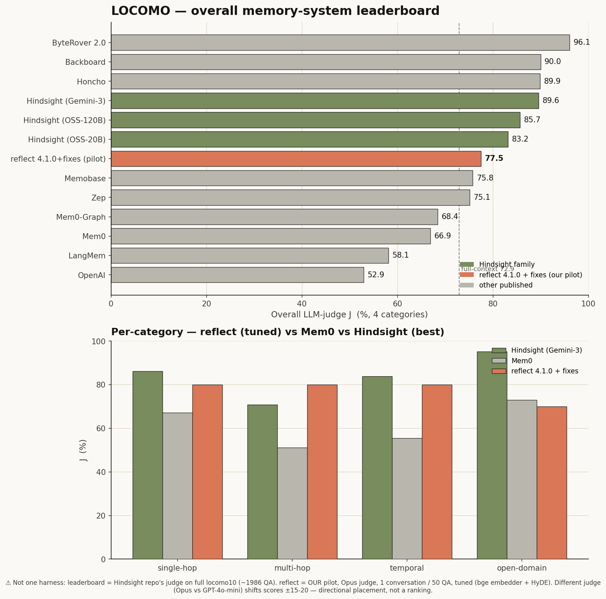

# LOCOMO benchmark for reflect-kb

Evaluates the **reflect 4.1.0** memory engine on [LOCOMO](https://github.com/snap-research/locomo)
(long-term conversational memory). Ingests multi-session dialogues through
reflect's real write→reindex→recall pipeline, answers the QA from retrieved
memory, and judges correctness (LLM-as-judge J-score) across an ablation matrix.

Latest results: **[REPORT.md](./REPORT.md)**.

## Results (preliminary pilot · conv-26 · Opus judge)

Answers generated by **Sonnet**, graded by an **Opus** reference LLM-judge. The judge
is load-bearing — the same answers grade ~0.07 lower under Sonnet and ~0.18 lower under
Haiku (cheaper judges under-credit valid paraphrases; see [REPORT.md §2](./REPORT.md)),
so all figures use the Opus reference. Retrieval is reflect-kb's real engine.

| config · Opus judge | single-hop | multi-hop | temporal | open-domain | adversarial | **overall** |
|---|:--:|:--:|:--:|:--:|:--:|:--:|
| reflect 4.1.0 (tuned recall + extraction) | 0.70 | 0.75 | 0.80 | 0.50 | 0.90 | **0.73** |
| **reflect 4.1.0 + retrieval fixes** (bge + HyDE) | 0.80 | 0.80 | 0.80 | 0.70 | 0.90 | **0.80** |

The **+fixes** knobs are additive, env-gated, and need **no new API key**:
`REFLECT_EMBED_MODEL=BAAI/bge-base-en-v1.5` (local embedder) + `REFLECT_RECALL_HYDE=1`
(HyDE, reusing reflect's `claude -p`). The R7 OOD gate (`REFLECT_RECALL_MIN_OVERLAP`)
over-suppressed at 0.15 and was dropped.



## Pipeline

```
sessions ─▶ extract atomic notes (claude -p) ─▶ reflect reindex (real engine)
question ─▶ recall.py (real engine, 57 arms via RECALL_* env) ─▶ context
         ─▶ answer (claude -p) ─▶ judge vs gold (claude -p) ─▶ J-score
```

Four configs: `arms_on` (4.1.0 recall arms), `arms_off` (≈4.0), `no_memory`
(floor), `full_context` (ceiling).

## Setup

```bash
# 1. dedicated venv with this worktree's reflect-kb[graph] (the global `reflect`
#    may be a stale install missing reflect_kb.cli.main)
cd reflect-kb
uv venv .venv-locomo --python 3.12
VIRTUAL_ENV=$PWD/.venv-locomo uv pip install -e ".[graph]"

# 2. dataset (not vendored)
curl -sL https://raw.githubusercontent.com/snap-research/locomo/main/data/locomo10.json \
  -o tests/eval/locomo/data/locomo10.json
```

All LLM calls go through `claude -p --setting-sources '' --strict-mcp-config`
(clean Sonnet, OAuth, no session hooks/CLAUDE.md/MCP — no API key needed).

## Run

```bash
cd reflect-kb/tests/eval/locomo
# stratified pilot: 10 QA per category, 1 conversation
python3 locomo_bench.py --samples 0 --per-cat 10 --tag pilot
# tuned retrieval
python3 locomo_bench.py --samples 0 --per-cat 10 --recall-limit 25 --recall-max-chars 10000 --tag tuned
# full benchmark (~$1k, hours)
python3 locomo_bench.py --samples all --tag full
# render the markdown scorecard
python3 make_report.py results/report_<tag>.json REPORT.md
```

Key flags: `--configs` (subset of the 4), `--recall-limit` / `--recall-max-chars`
(retrieval budget — the biggest lever on multi-hop), `--recall-concurrency`
(torch-bound, keep ≤3), `--concurrency` (claude answer/judge), `--per-cat` /
`--limit-qa` (scope). Runs are resumable — per-session extraction and per-QA
verdicts are cached under `results/cache/` (tag-scoped).

## Notes

- **Retrieval is the real engine**; the dialogue→note *extraction* is a
  LOCOMO-domain adapter (reflect's shipped writer targets coding transcripts).
- Recall reloads sentence-transformers + nano-graphrag per `recall.py`
  subprocess (~20–45s/query) — the dominant wall-time cost.
